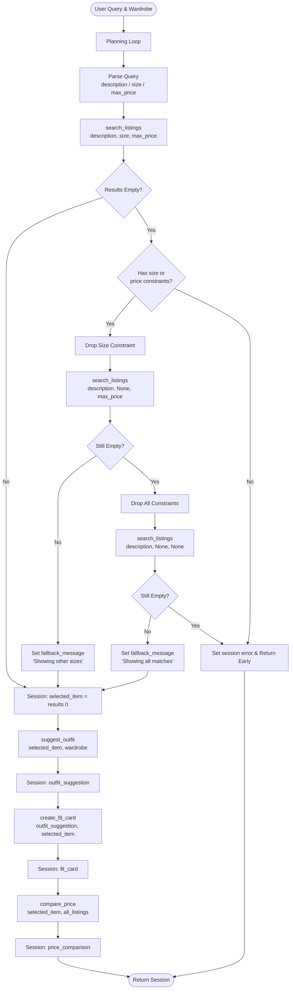

# FitFindr — planning.md

> Complete this document before writing any implementation code.
> Your spec and agent diagram are what you'll use to direct AI tools (Claude, Copilot, etc.) to generate your implementation — the more specific they are, the more useful the generated code will be.
> Your planning.md will be reviewed as part of your submission.
> Update it before starting any stretch features.

---

## Tools

### Tool 1: search_listings

**What it does:**
Searches the mock listings dataset for items matching a description, optional size, and optional maximum price, scoring by keyword overlap with the description.

**Input parameters:**
- `description` (str): Keywords describing the desired item (e.g., "vintage graphic tee").
- `size` (str): Optional. Size string to filter by, case-insensitive (e.g., "M").
- `max_price` (float): Optional. Maximum price ceiling.

**What it returns:**
A list of dictionary objects representing matched listings. The list is sorted by relevance score (highest keyword overlap first). Each listing contains: `id` (str), `title` (str), `description` (str), `category` (str), `style_tags` (list[str]), `size` (str), `condition` (str), `price` (float), `colors` (list[str]), `brand` (str|None), `platform` (str).

**What happens if it fails or returns nothing:**
If no matches are found, the tool returns an empty list `[]`. The agent handles this empty list by triggering a fallback search (retry logic stretch feature) or returning an error message if the fallback also fails.

---

### Tool 2: suggest_outfit

**What it does:**
Given a selected thrifted item and the user's wardrobe, it uses an LLM to generate 1–2 complete outfit suggestions.

**Input parameters:**
- `new_item` (dict): The listing dictionary representing the new item the user is considering.
- `wardrobe` (dict): The user's wardrobe dictionary containing an 'items' key (list[dict]). Each wardrobe item has: `id`, `name`, `category`, `colors`, `style_tags`, `notes`.

**What it returns:**
A non-empty string containing detailed outfit suggestions generated by the LLM. If wardrobe is populated, suggestions reference specific wardrobe pieces by name. If wardrobe is empty, suggestions are general styling advice.

**What happens if it fails or returns nothing:**
If the wardrobe is empty (`wardrobe['items'] == []`), the tool falls back to generating general styling advice for the item rather than crashing.

---

### Tool 3: create_fit_card

**What it does:**
Generates a short, shareable social-media style caption (fit card) describing the thrifted find and the outfit.

**Input parameters:**
- `outfit` (str): The outfit suggestion string produced by `suggest_outfit()`.
- `new_item` (dict): The listing dictionary of the thrifted item.

**What it returns:**
A 2-4 sentence string usable as a social media caption, generated by an LLM with higher temperature (0.9) for variety. The caption mentions item name, price, and platform naturally.

**What happens if it fails or returns nothing:**
If the `outfit` string is missing, empty, or whitespace-only, it returns a descriptive error message string (`"Error: No outfit data provided to generate a fit card."`) instead of crashing.

---

### Tool 4: compare_price (stretch)

**What it does:**
Estimates whether an item's price is fair by comparing it against other listings in the same category from the dataset.

**Input parameters:**
- `item` (dict): The selected listing. Must contain `price` (float) and `category` (str).
- `listings` (list[dict]): The full listings dataset from `load_listings()`.

**What it returns:**
A string containing: a verdict emoji (🟢/🟡/🔴), the item's price, an explanation sentence, and data points (median price, min/max range, comparable count). Example:
```
🟢 Great deal — $22.00
This is 37% below the median — a solid find.

Comparable thrifted tops on resale:
  • Median price: $34.00
  • Range: $15.00 – $52.00
  • Based on 18 similar listing(s)
```

**Comparison logic:** Items >20% below median → Great deal; within ±20% → Fair price; >20% above median → Pricey.

**What happens if it fails or returns nothing:**
- If item has no `price` key → returns `"Unable to assess price — no price data available."`
- If fewer than 2 comparables in category → returns a "not enough data" message.
- Does NOT raise an exception in either case.

---

## Planning Loop

**How does your agent decide which tool to call next?**

The planning loop operates sequentially but with conditional branches and a retry mechanism (Stretch Feature).

1. **Parse**: Regex extracts `max_price` (e.g., `$30` → `30.0`) and `size` (e.g., `size M` → `"M"`). The remainder (after stripping numeric tokens and filler words) becomes `description`.

2. **Search & Retry (Stretch Feature)**:
   - Call `search_listings(description, size, max_price)`.
   - **Branch A** — if `results` is not empty: skip to Step 4.
   - **Branch B** — if `results` is empty AND size or max_price was present:
     - Retry 1: call `search_listings(description, None, max_price)` (drop size).
     - If retry 1 returns results → set `session["fallback_message"]`, skip to Step 4.
     - Retry 2: if still empty, call `search_listings(description, None, None)` (drop all constraints).
     - If retry 2 returns results → set `session["fallback_message"]`, skip to Step 4.

3. **Check state**: If still empty after all retries → set `session["error"]` = actionable message → `return session` early. `suggest_outfit` and `create_fit_card` are **not called**.

4. **Select item**: `session["selected_item"] = results[0]` (top relevance-scored result).

5. **Suggest outfit**: Call `suggest_outfit(selected_item, wardrobe)`. Store result in `session["outfit_suggestion"]`. If wardrobe is empty, `suggest_outfit` handles this gracefully.

6. **Create fit card**: Call `create_fit_card(session["outfit_suggestion"], session["selected_item"])`. Store in `session["fit_card"]`.

7. **Price comparison (stretch)**: Call `compare_price(session["selected_item"], load_listings())`. Store in `session["price_comparison"]`.

8. **Return** the fully populated session dict.

---

## State Management

**How does information from one tool get passed to the next?**

State is tracked within a single `session` dictionary instantiated per interaction via `_new_session()`:

| Key | Set when | Passed to |
|-----|----------|-----------|
| `session["parsed"]` | After query parsing | — (diagnostic only) |
| `session["search_results"]` | After `search_listings` returns results | — |
| `session["selected_item"]` | `results[0]` is assigned | `suggest_outfit`, `create_fit_card`, `compare_price` |
| `session["outfit_suggestion"]` | After `suggest_outfit` | `create_fit_card` |
| `session["fit_card"]` | After `create_fit_card` | UI (Gradio output panel) |
| `session["price_comparison"]` | After `compare_price` | UI (Gradio output panel) |
| `session["fallback_message"]` | When retry logic fires | UI (prepended to listing text) |
| `session["error"]` | On early termination | UI (replaces all output) |

No data is re-entered by the user between steps. The user enters a single query; all downstream tool inputs are drawn from the session dict.

---

## Error Handling

| Tool | Failure mode | Agent response |
|------|-------------|----------------|
| `search_listings` | No results match the query | Attempts retry by dropping size constraints, then all constraints. If still empty, sets `session["error"]` with an actionable message ("Try broader keywords or remove size/price filters.") and halts. |
| `suggest_outfit` | Wardrobe is empty | Detects empty `wardrobe['items']` and prompts the LLM to give generic styling tips for the item instead of specific wardrobe combinations. |
| `create_fit_card` | Outfit input is missing or incomplete | Guards against empty/whitespace outfit string and returns `"Error: No outfit data provided to generate a fit card."` — no crash. |
| `compare_price` | Item missing price field | Returns `"Unable to assess price — no price data available."` |
| `compare_price` | No comparable listings in category | Returns a "not enough data" string explaining the gap. |

---

## Architecture



---

## AI Tool Plan

**Milestone 3 — Individual tool implementations:**
- I used Antigravity IDE to implement `tools.py`.
- I provided the Tool 1, 2, and 3 specifications from this document (inputs, return values, failure modes) as context.
- I verified: `search_listings` handles case-insensitive size, keyword scoring, and returns empty lists; `suggest_outfit` handles empty `wardrobe['items']`; `create_fit_card` guards against empty outfit strings.
- I ran pytest to confirm all tests pass before moving to the next milestone.

**Milestone 4 — Planning loop and state management:**
- I used Antigravity IDE to implement `agent.py`.
- I provided the "Planning Loop" section and the Mermaid architecture diagram as context.
- I verified: happy path populates all session fields; no-results path sets `session["error"]` and halts without calling `suggest_outfit`; empty wardrobe path produces general advice.

**Stretch Feature 1 — Price Comparison Tool:**
- I used Antigravity IDE to add `compare_price` to `tools.py`.
- I provided Tool 4 spec above and asked for a data-driven (no LLM) implementation using median/range statistics.
- I verified: correct verdict thresholds; graceful handling of missing price and no comparables; correct exclusion of the item itself from comparables.

**Stretch Feature 2 — Style Profile Memory:**
- I used Antigravity IDE to implement `load_style_profile()`, `save_style_profile()` in `utils/data_loader.py` and the profile tab UI in `app.py`.
- I verified: profile round-trips correctly through save/load; wardrobe items added in the UI appear in subsequent sessions; past searches are capped at 20.

**Stretch Feature 3 — Retry Logic with Fallback (already in agent.py):**
- Implemented as part of the planning loop using the architecture diagram.
- Verified: agent drops size constraint first, then all constraints, and surfaces a `fallback_message` in the UI when constraints are loosened.

---

## A Complete Interaction (Step by Step)

**Example user query:** "I'm looking for a vintage graphic tee under $30. I mostly wear baggy jeans and chunky sneakers. What's out there and how would I style it?"

**Step 1 — Parse:**
The planning loop extracts `description="vintage graphic tee"`, `max_price=30`, `size=None`.

**Step 2 — search_listings called:**
`search_listings("vintage graphic tee", size=None, max_price=30.0)` returns a list of matching items. The top result is stored: e.g., `{'title': 'Graphic Tee — 2003 Tour Bootleg Style', 'price': 24.00, ...}`. This is stored in `session["selected_item"]`.

**Step 3 — suggest_outfit called:**
`suggest_outfit(session["selected_item"], wardrobe)` is called. The LLM sees the item details and the user's wardrobe (baggy jeans, chunky sneakers). Returns: "Pair this vintage graphic tee with your baggy dark-wash jeans — cuff them once at the ankle — and your chunky white sneakers for a classic 90s streetwear look." Stored in `session["outfit_suggestion"]`.

**Step 4 — create_fit_card called:**
`create_fit_card(session["outfit_suggestion"], session["selected_item"])` is called. Returns: "snagged this bootleg-style graphic tee for $24 and honestly it was made for my baggy jeans 🖤 full look dropping soon." Stored in `session["fit_card"]`.

**Step 5 — compare_price called:**
`compare_price(session["selected_item"], load_listings())` computes median tops price and classifies the $24 tee. Returns: "🟡 Fair price — $24.00. This is right in line with typical thrifted tops prices. Median: $22.00 | Range: $15–$52 | Based on 18 listings."

**Final output to user:**
- Panel 1 "Top listing": title, price, platform, size, description
- Panel 2 "Outfit idea": the full outfit suggestion
- Panel 3 "Fit card": the shareable caption
- Panel 4 "Price check": the price assessment with data

**Error path (e.g., "designer ballgown size XXS under $5"):**
`search_listings` returns `[]`. Agent retries without size → still `[]`. Retries without all constraints → still `[]`. Sets `session["error"]` = "No listings found. Try broader keywords or remove size/price filters." Returns immediately — `suggest_outfit` and `create_fit_card` are never called.
